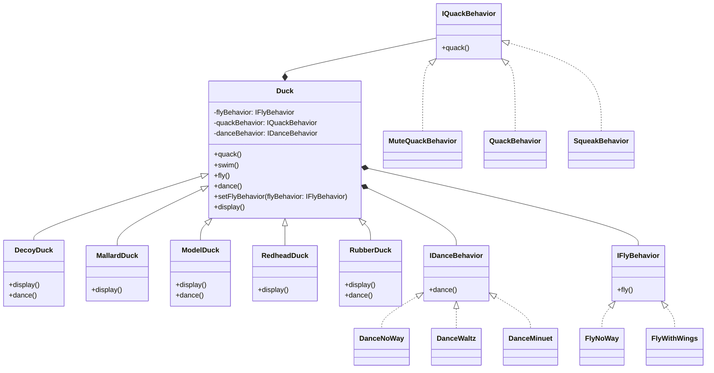

```mermaid
classDiagram
    class Duck:::abstract {
        +quack()
        +swim()
        +fly()
        +dance()
        +setFlyBehavior(flyBehavior: IFlyBehavior)
        +display()
        
        -flyBehavior: IFlyBehavior
        -quackBehavior: IQuackBehavior
        -danceBehavior: IDanceBehavior
    }
    
    Duck <|-- DecoyDuck
    
    class DecoyDuck {
        +display()
        +dance()
    }
    
    Duck <|-- MallardDuck
    
    class MallardDuck {
        +display()
    }
    
    Duck <|-- ModelDuck
    
    class ModelDuck {
        +display()
        +dance()
    }
    
    Duck <|-- RedheadDuck
    
    class RedheadDuck {
        +display()
    }
    
    Duck <|-- RubberDuck 
    
    class RubberDuck {
        +display()
        +dance()
    }
    
    IQuackBehavior --* Duck
    Duck *-- IDanceBehavior
    Duck *-- IFlyBehavior
    
    class IQuackBehavior {
        +quack()
    }
    
    class IDanceBehavior {
        +dance()
    }
    
    class IFlyBehavior {
        +fly()
    }
    
    IQuackBehavior <|.. MuteQuackBehavior
    IQuackBehavior <|.. QuackBehavior
    IQuackBehavior <|.. SqueakBehavior
        
    IFlyBehavior <|.. FlyNoWay
    IFlyBehavior <|.. FlyWithWings
    
    IDanceBehavior <|.. DanceNoWay
    IDanceBehavior <|.. DanceWaltz
    IDanceBehavior <|.. DanceMinuet
```