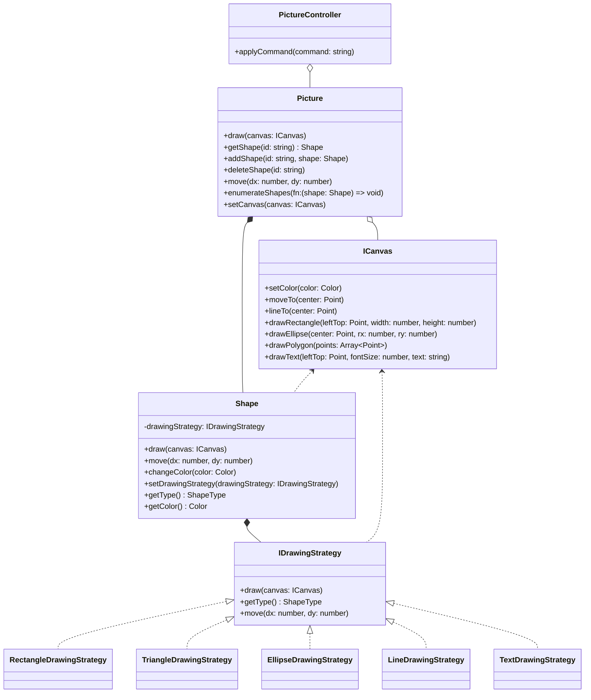

```mermaid
classDiagram
    class Picture {
        +draw(canvas: ICanvas)
        +getShape(id: string) Shape
        +addShape(id: string, shape: Shape)
        +deleteShape(id: string)
        +move(dx: number, dy: number)
        +enumerateShapes(fn: (shape: Shape) => void)
        +setCanvas(canvas: ICanvas)
    }

    Picture *-- Shape

    class Shape {
        -drawingStrategy: IDrawingStrategy

        +draw(canvas: ICanvas)
        +move(dx: number, dy: number)
        +changeColor(color: Color)
        +setDrawingStrategy(drawingStrategy: IDrawingStrategy)
        +getType() ShapeType
        +getColor() Color
    }
    
    PictureController o-- Picture
    
    class PictureController {
        +applyCommand(command: string)
    }
    
    Picture o-- ICanvas
    
    class ICanvas {
        +setColor(color: Color)
        +moveTo(center: Point)
        +lineTo(center: Point)
        +drawRectangle(leftTop: Point, width: number, height: number)
        +drawEllipse(center: Point, rx: number, ry: number)
        +drawPolygon(points: Array~Point~)
        +drawText(leftTop: Point, fontSize: number, text: string)
    }
    
    Shape *-- IDrawingStrategy
    ICanvas <.. IDrawingStrategy
    ICanvas <.. Shape

    class IDrawingStrategy {
        +draw(canvas: ICanvas)
        +getType() ShapeType
        +move(dx: number, dy: number)
    }
    
    IDrawingStrategy <|.. RectangleDrawingStrategy
    IDrawingStrategy <|.. TriangleDrawingStrategy
    IDrawingStrategy <|.. EllipseDrawingStrategy
    IDrawingStrategy <|.. LineDrawingStrategy
    IDrawingStrategy <|.. TextDrawingStrategy
```

TODO: добавить поля в стратегии

test
AddShape sh1 #123456 rectangle 10 20 30 40
AddShape tr1 #00fefe triangle 0 0 10 0 0 10