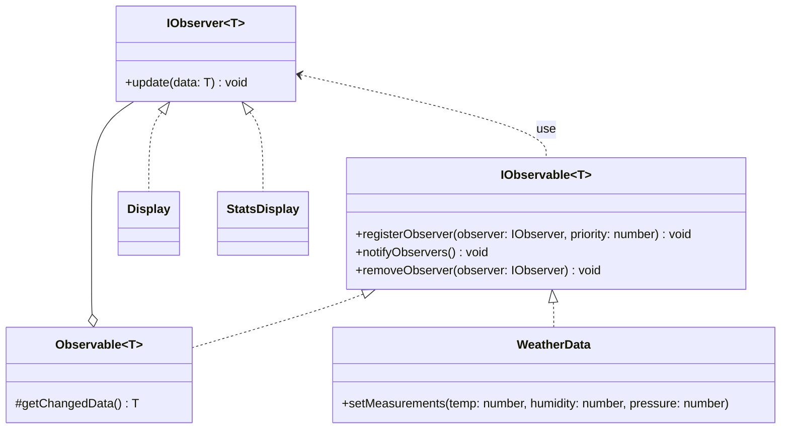

```mermaid
classDiagram
    class IObserver~T~ {
        +update(data: T) void   
    }
    
    IObserver~T~ <.. IObservable~T~: use
    
    class IObservable~T~ {
        +registerObserver(observer: IObserver<T>, priority: number) void
        +notifyObservers() void
        +removeObserver(observer: IObserver<T>) void
    }
    
    IObservable <|.. Observable~T~
    IObserver --o Observable
    
    class Observable~T~ {
        #getChangedData() T
    }
    
    IObserver <|.. Display
    IObserver <|.. StatsDisplay
    IObservable <|.. WeatherData

    class WeatherData {
        +setMeasurements(temp: number, humidity: number, pressure: number)
    }
```