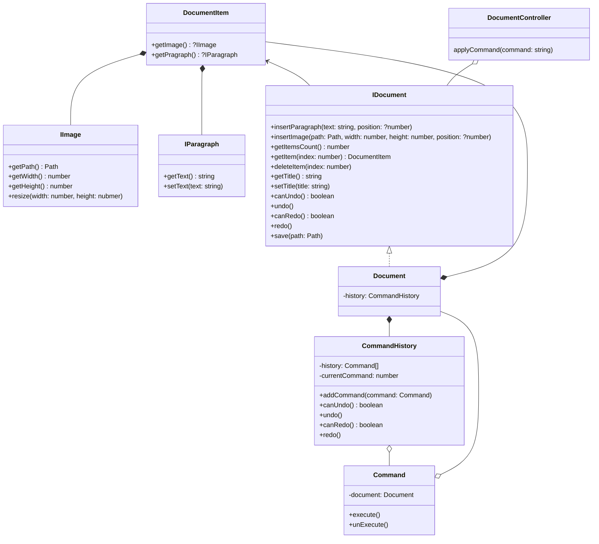

```mermaid
classDiagram
    class IImage {
        +getPath() Path
        +getWidth() number
        +getHeight() number
        +resize(width: number, height: nubmer)
    }
    
    class IParagraph {
        +getText() string
        +setText(text: string)
    }
    
    DocumentItem *-- IImage
    DocumentItem *-- IParagraph
    
    class DocumentItem {
        +getImage() ?IImage
        +getPragraph() ?IParagraph
    }
    
    DocumentItem <-- IDocument
    
    class IDocument {
        +insertParagraph(text: string, position: ?number)
        +insertImage(path: Path, width: number, height: number, position: ?number)
        +getItemsCount() number
        +getItem(index: number) DocumentItem
        +deleteItem(index: number)
        +getTitle() string
        +setTitle(title: string)
        +canUndo() boolean
        +undo()
        +canRedo() boolean
        +redo()
        +save(path: Path)
    }
    
    Command o-- Document
    
    class Command {
        -document: Document
        
        +execute()
        +unExecute()
    }
    
    CommandHistory o-- Command
    
    class CommandHistory {
        -history: Command[]
        -currentCommand: number
        
        +addCommand(command: Command)
        +canUndo() boolean
        +undo()
        +canRedo() boolean
        +redo()
    }
    
    IDocument <|.. Document
    Document *-- DocumentItem
    Document *-- CommandHistory
    
    class Document {
        -history: CommandHistory
    }
    
    DocumentController o-- IDocument
    
    class DocumentController {
        applyCommand(command: string)
    }
```