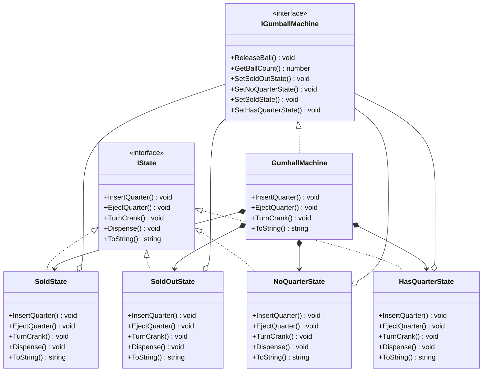

```mermaid
classDiagram
    class IGumballMachine {
        <<interface>>
        +ReleaseBall() void
        +GetBallCount() number
        +SetSoldOutState() void
        +SetNoQuarterState() void
        +SetSoldState() void
        +SetHasQuarterState() void
    }

    class IState {
        <<interface>>
        +InsertQuarter() void
        +EjectQuarter() void
        +TurnCrank() void
        +Dispense() void
        +ToString() string
    }

    class GumballMachine {
        +InsertQuarter() void
        +EjectQuarter() void
        +TurnCrank() void
        +ToString() string
    }

    class SoldState {
        +InsertQuarter() void
        +EjectQuarter() void
        +TurnCrank() void
        +Dispense() void
        +ToString() string
    }

    class SoldOutState {
        +InsertQuarter() void
        +EjectQuarter() void
        +TurnCrank() void
        +Dispense() void
        +ToString() string
    }

    class HasQuarterState {
        +InsertQuarter() void
        +EjectQuarter() void
        +TurnCrank() void
        +Dispense() void
        +ToString() string
    }

    class NoQuarterState {
        +InsertQuarter() void
        +EjectQuarter() void
        +TurnCrank() void
        +Dispense() void
        +ToString() string
    }

    IGumballMachine <|.. GumballMachine
    IState <|.. SoldState
    IState <|.. SoldOutState
    IState <|.. HasQuarterState
    IState <|.. NoQuarterState
    GumballMachine *--> SoldState
    GumballMachine *--> SoldOutState
    GumballMachine *--> NoQuarterState
    GumballMachine *--> HasQuarterState

    IGumballMachine --o SoldState
    IGumballMachine --o SoldOutState
    IGumballMachine --o NoQuarterState
    IGumballMachine --o HasQuarterState

```

TODO: IGumballMachine убрать наследование, сделать аггрегацию или композицтб, чтобы не было доступа к методам

TODO: Разобраться в достоинствах и недостатках переключения состояний