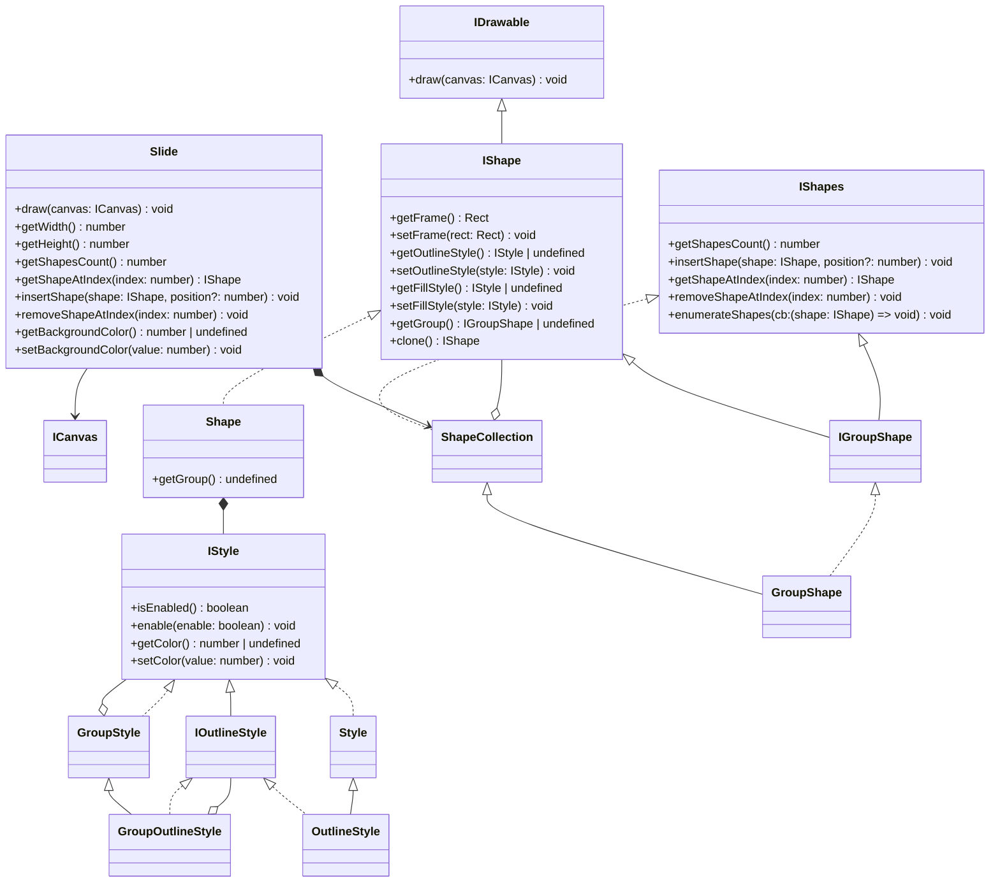

```mermaid
classDiagram
    class ICanvas {
    }

    class IDrawable {
        +draw(canvas: ICanvas) void
    }

    class IStyle {
        +isEnabled() boolean
        +enable(enable: boolean) void
        +getColor() number | undefined
        +setColor(value: number) void
    }

    class IOutlineStyle {
    }

    class Style {
    }
    
    class OutlineStyle

    class IShape {
        +getFrame() Rect
        +setFrame(rect: Rect) void
        +getOutlineStyle() IStyle | undefined
        +setOutlineStyle(style: IStyle) void
        +getFillStyle() IStyle | undefined
        +setFillStyle(style: IStyle) void
        +getGroup() IGroupShape | undefined
        +clone() IShape
    }

    class Shape {
        +getGroup() undefined
    }

    class IShapes {
        +getShapesCount() number
        +insertShape(shape: IShape, position?: number) void
        +getShapeAtIndex(index: number) IShape
        +removeShapeAtIndex(index: number) void
        +enumerateShapes(cb: (shape: IShape) => void) void
    }

    class ShapeCollection {
    }

    class IGroupShape {
    }

    class GroupShape {
    }

    class Slide {
        +draw(canvas: ICanvas) void
        +getWidth() number
        +getHeight() number
        +getShapesCount() number
        +getShapeAtIndex(index: number) IShape
        +insertShape(shape: IShape, position?: number) void
        +removeShapeAtIndex(index: number) void
        +getBackgroundColor() number | undefined
        +setBackgroundColor(value: number) void
    }

    IDrawable <|-- IShape
    IShape <|.. Shape
    IShapes <|.. ShapeCollection
    ShapeCollection <|-- GroupShape
    IGroupShape <|.. GroupShape
    IShape <|-- IGroupShape 
    IShapes <|-- IGroupShape 
    IStyle --o GroupStyle
    IStyle <|.. Style
    IStyle <|.. GroupStyle
    GroupStyle <|-- GroupOutlineStyle
    IStyle <|-- IOutlineStyle
    IOutlineStyle <|.. GroupOutlineStyle
    IOutlineStyle --o GroupOutlineStyle
    IOutlineStyle <|.. OutlineStyle
    Style <|-- OutlineStyle
    Slide *--> ShapeCollection
    IShape --o ShapeCollection
    Slide --> ICanvas
    Shape *-- IStyle
```

TODO: IShapes в IShapeGroup, 